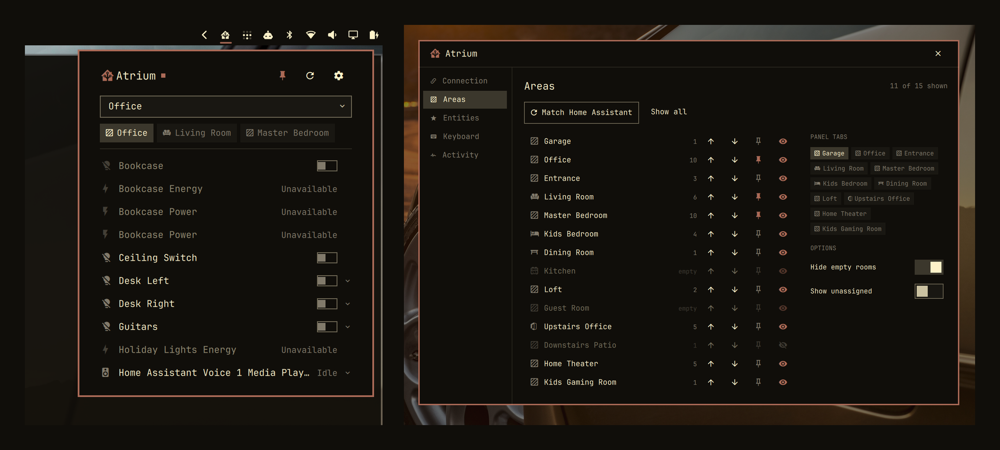

# Atrium

Control your Home Assistant devices from the Omarchy bar, grouped by area.
Lights, thermostats, media players, covers, fans and locks, each with the
controls it supports.

> Not affiliated with or endorsed by the Home Assistant project.



## Features

- Switch rooms from a dropdown, and pin the rooms you use most
- Room order and hidden rooms are taken from your Home Assistant dashboard the first time you connect
- Shows the same devices your Home Assistant dashboard shows
- Pin individual devices to a tab of their own
- Works from the keyboard, and from commands you can put on a keybind

## Requirements

- Omarchy 4.0 or newer
- Rust, to build once at install time
- `secret-tool` (libsecret) with a running keyring

## Install

```sh
omarchy plugin add https://github.com/bitshiftxr/atrium.git --enable
~/.config/omarchy/plugins/io.github.bitshiftxr.atrium/setup
```

`setup` does the build, and installs Rust for you if it is missing. It builds
under `~/.cache/atrium/` and copies only the finished binary into the plugin
directory, because the shell reloads on every file event inside that directory.

## Bar position

```sh
omarchy bar move io.github.bitshiftxr.atrium --section left
```

## Setup

Open the panel and press `s`, then enter your Home Assistant address and an
access token. Tokens live in Home Assistant under your profile → Security →
Long-lived access tokens.

The settings window has five panes:

- **Connection** takes the address and the token, and shows the connection state.
- **Areas** lists every room, how many devices are in it, and lets you show,
  hide, reorder and pin each one.
- **Entities** pins individual devices to a tab in front of your rooms.
- **Keyboard** lists the shortcuts and commands.
- **Activity** is a log of the last 200 actions and problems, filterable down to
  problems only.

## What you can control

| Device | Controls |
| --- | --- |
| Lights | On/off, brightness, warmth, and colour |
| Switches, fans, humidifiers, sirens, remotes, toggle helpers | On/off, and fan speed |
| Locks | Lock and unlock |
| Scenes, scripts, buttons | Activate |
| Media players | Previous, play/pause, next, volume, mute |
| Covers | Open, stop, close, and position |
| Thermostats | Mode, target temperature or range, fan and preset |
| Sensors and everything else | Current state |

Controls come from what each device reports. A light that cannot change colour
has no colour swatch; a cover that cannot report its position has no slider.

## Keyboard

With the panel open: `j`/`k` or `↑`/`↓` move between devices, `h`/`l` or
`←`/`→` change room, `enter` or `space` switches a device on or off, `e` opens
its controls, `r` refreshes, `s` opens settings, `tab` moves to the next bar
panel, and `esc` closes.

## Commands

```sh
omarchy-shell atrium toggle                      # open or close the panel
omarchy-shell atrium open
omarchy-shell atrium close
omarchy-shell atrium refresh                     # re-read from Home Assistant
omarchy-shell atrium toggleEntity light.desk
omarchy-shell atrium activate scene.movie_night
omarchy-shell atrium areas                       # room names, one per line
omarchy-shell atrium rooms                       # settings, on the Areas pane
omarchy-shell atrium settings                    # settings, on the Connection pane
omarchy-shell atrium status                      # state and counts, as JSON
```

`toggleEntity` and `activate` refuse locks, covers and alarm panels; see
[Security](#security).

## Settings file

Your settings are saved to `~/.config/atrium/config.json`: the Home Assistant
address, your room preferences, what you have pinned, and the
`allowSensitiveIpc` switch described below. `ATRIUM_CONFIG` overrides the path.

## Security

Your access token is stored in your system keyring.

Certificates are checked against the system trust store. The connection is a
direct WebSocket to Home Assistant, so proxy variables in your environment have
no effect. An address with no `https://` is treated as secure; a plain `http://`
address works but warns you first, because it sends your token unencrypted.

Locks, covers and alarm panels can only be operated from the panel. Every
process running as your user can reach the shell's IPC socket, so
`omarchy-shell atrium toggleEntity lock.front_door` is refused until you set
`"allowSensitiveIpc": true` in `~/.config/atrium/config.json`. Everything else
is actionable from a command.

Atrium can only perform the actions listed above, from the panel or from a
command. It reads only the device details those actions need, which does not
include camera tokens, media links or location.

## Development

```sh
cd daemon
cargo test
cargo clippy --all-targets
```

```sh
omarchy plugin validate .
qmllint -I "$OMARCHY_PATH/shell" -I . Bridge.qml DaemonFailureTest.qml \
  EntityRow.qml Glyph.qml Service.qml Settings.qml controls/*.qml settings/*.qml
```

`Panel.qml` is left out of that list because qmllint 1.0 exits 255 on it with no
diagnostics.

```sh
./test-daemon-failure
```

Runs `Service.qml` under quickshell against four daemons — one missing, one that
exits on startup, the real one, and one that appears twelve seconds in — and
checks that the panel reports the failure, keeps reporting it, and clears once
the daemon works. It needs a Wayland session and takes about 90 seconds, so it
is not part of `cargo test`.

To see what the panel would draw without starting the shell:

```sh
ATRIUM_TOKEN='<your token>' ./bin/atriumd probe https://homeassistant.local:8123 --rows
```

`atriumd call <url> <entity> <action> [json]` resolves one action the way the
panel would and sends it. Both read the token from `ATRIUM_TOKEN` or stdin,
never from an argument, where it would be visible to every process on the
machine.

Two tests can run against a real Home Assistant. They are skipped unless
`ATRIUM_FIXTURE` points at a JSON file holding the areas, floors, devices,
entities, states and dashboard config of an instance. Keep that file out of the
repository; it lists every room and device in a home. The rest of the suite
needs no instance and no network.

## Remove

```sh
omarchy plugin remove io.github.bitshiftxr.atrium
```

## License

MIT — see [`LICENSE`](LICENSE).
